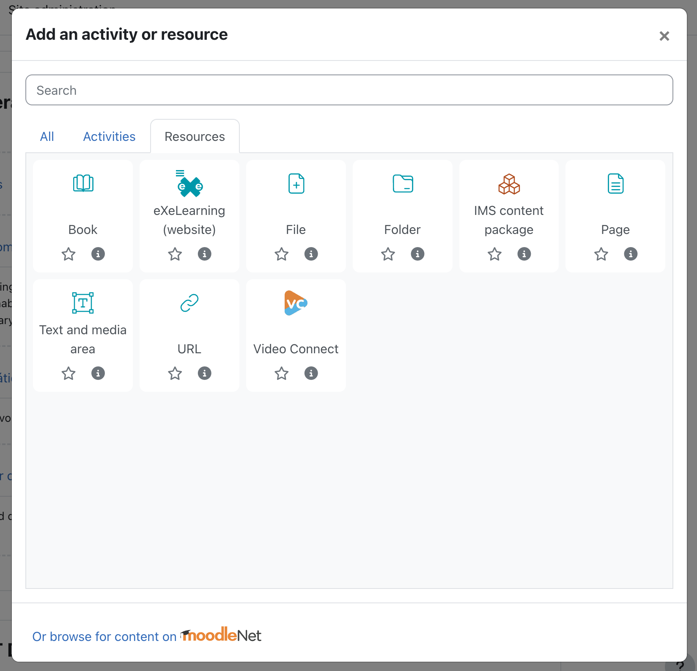
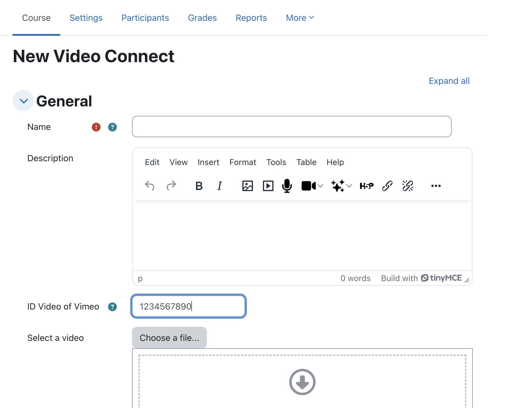

# Tresipunt Vimeo

This module allows users to upload a video as a resource, which is then automatically uploaded to their Vimeo account through a scheduled task. 

If you already know the video ID, you can enter it directly. When rendering the video, if the upload process is still ongoing, Vimeo displays a message indicating that the video is being uploaded.

## Features

This plugin allows you to upload a video from Moodle to the private Vimeo platform and display it as a label, which is embedded on the main page of the course. It allows both uploading a video and embedding it, or showing it if it's already uploaded to Vimeo. The goal is to centralize the video repository on Vimeo.

### Notes for the Administrator:

To use the plugin, you need a [Pro](https://vimeo.com/professionals), [Business](https://vimeo.com/business), [Premium](https://vimeo.com/features/livestreaming), or [Enterprise](https://vimeo.com/enterprise) Vimeo membership.

**Configuring a scheduled task: Ensure the scheduled task is enabled**

#### API Configuration:

On Vimeo: [https://developer.vimeo.com/api/guides/start](https://developer.vimeo.com/api/guides/start)

- App created: 
    - Client ID: YOUR\_VIMEO\_CLIENT
    - Client Secret: YOUR\_VIMEO\_SECRET
    - Personal Access Token: YOUR\_VIMEO\_ACCESS\_TOKEN
    - Authentication: Yes
    - Scopes of the Personal Access Token: private, public, and upload.

**Note:** To get 'upload' permissions, you must make a request to Vimeo, which takes about 12 hours.

These credentials will be used to configure the Moodle plugin:  
[https://YOUR_MOODLE_SITE/admin/settings.php?section=modsettingtresipuntvimeo](https://YOUR_MOODLE_SITE/admin/settings.php?section=modsettingtresipuntvimeo)

⚠️ *If not configured, or if the folder is incorrect, the video will always be uploaded to the root of Vimeo. The user will still be able to view the video without issues, and the Vimeo admin can fix the error without affecting Moodle visibility.*

### Adding Video Activity to a Course – Upload Video

Upload the video. The admin should configure the folder id, if not all videos will be on root folder.

1. **Add Video to Vimeo from the plugin:**
   

2. **A screen will show that the video is unavailable.**  
   Wait for the scheduled task to make it visible, or grant permission on Vimeo if the automation fails.

3. **Access Vimeo and grant the corresponding permissions:**
    - Click on Share  
    - Hide from Vimeo 
    - Add domain 

5. **The video will now be visible in your course.**  

### Adding Video Activity to a Course – Embed Video

With the same activity module, it is possible to embed a video using the video ID, which is more secure than using an iframe.

1. **Add a resource in a topic:**  
   

2. **Configure:**  
   Enter the video ID, which can be found on Vimeo:  
   

   

   
3. **Ensure the video has the correct permissions on Vimeo:**  
    - Click on Share 
    - Hide from Vimeo 
    - Add domain 

## Credits

This plugin was implemented by Moodle's Partner [3iPunt](https://tresipunt.com/)

## License

This program is free software: you can redistribute it and/or modify it under
the terms of the GNU General Public License as published by the Free Software
Foundation, either version 3 of the License, or (at your option) any later
version.

This program is distributed in the hope that it will be useful, but WITHOUT ANY
WARRANTY; without even the implied warranty of MERCHANTABILITY or FITNESS FOR A
PARTICULAR PURPOSE.  See the GNU General Public License for more details.

You should have received a copy of the GNU General Public License along with
this program.  If not, see <http://www.gnu.org/licenses/>.
